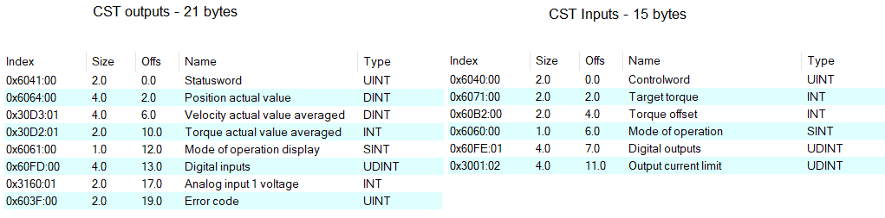

# Maxon_EPOS4_PDO_Mapping

This repositories helps the user to program the EtherCAT PDO mapping of a Maxon EPOS4 Driver through TwinCAT (Available only for Windows).

## Installation

Install EPOS Studio

Install TwinCAT 3.1 – eXtended Automation Engineering (XAE) - 3.1.4024.7.

Follow instructions at [this link (Maxon EPOS4 Application Notes)](https://www.maxongroup.fr/medias/sys_master/8828280471582.pdf)

## PDO Mapping

